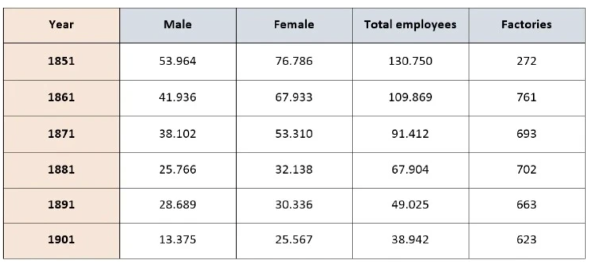

*The table shows the number of employees and factories producing silk in England and Wales betewen 1851 and 1901.*

Analys:
With table, we should analysys the columns before rows.
In table with years (between 1851 and 1901), we use vocabularies describe trend like using in Line graph.

Unit: number
Tense: all the years is in the past -> past simple

body 1: males - females - total employees

body 2: factories

Sample:

The table illustrates the number of employees and silk-manufactoring fatories in England and Wales between 1851 and 1901.
Overall, the total workforce in the silk industry declined markedly over the 50-year period. A similar downward trend was observed in the number of factories, despite some short-term fluctuations. It is also notable that female employees consistently outnumbered their male counterparts.
In 1851, the silk industry employed 130,750 workers in total, including 76,768 women and 53,964 men. Over the following decades, these figures fell steadily. By 1901, the numbers of female and male workers had dropped to 26,567 and 13,375 respectively, resulting a dramatic contraction in the total workforce to just 38,942.
Regarding factories, there were only 272 in 1851, the lowest figure recorded in the table. This number then surged dramatically to 761 in 1861, nearly triple the initial level. Afterwards, the figure fluctuated slightly before gradually declining to 623 by 1901.